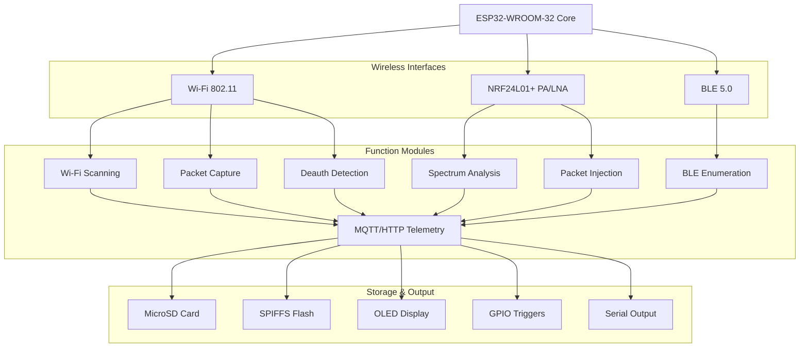
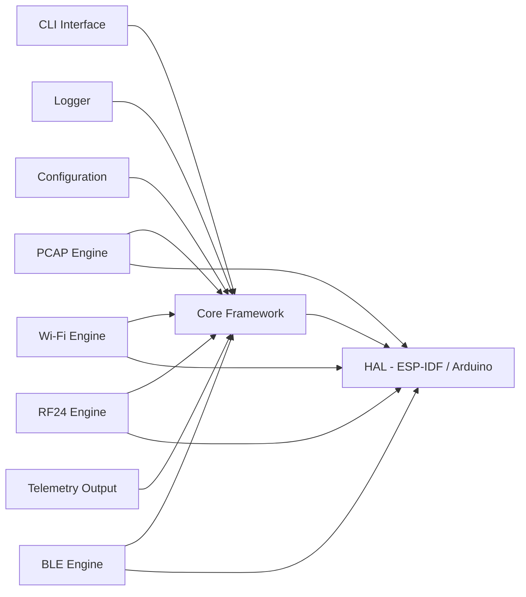

<div align="center">

# ESP32-HARNESS

**Advanced ESP32 Pentesting, Audit & Telemetry Firmware**

A complete reimplementation & upgrade of PRJCT HYDRA — a single-board pentest and telemetry instrument for 2.4 GHz research, RF24 experimentation, and on-device forensic capture.

[]()
[]()
[]()

</div>

---

## Overview

ESP32-HARNESS transforms the ESP32 into a portable, self-contained security research platform. Built for authorized penetration testing, security auditing, and RF telemetry — it consolidates multiple hardware tools into a single firmware running on a $5 microcontroller.

> **Legal Notice**: This tool is designed exclusively for authorized security testing, educational purposes, and legitimate RF research. Users are responsible for compliance with local laws and regulations.

## Planned Capabilities

### 2.4 GHz Research
- **Wi-Fi scanning & analysis** — Passive and active wireless reconnaissance
- **Packet capture** — Raw 802.11 frame capture with PCAP export
- **Deauth detection** — Monitor for deauthentication attacks in real-time
- **Probe request tracking** — Device presence detection and tracking

### RF24 Experimentation
- **NRF24L01+ integration** — 2.4 GHz ISM band experimentation
- **Spectrum analysis** — Channel utilization and signal strength mapping
- **Packet injection** — Controlled RF packet transmission for testing
- **Frequency hopping analysis** — BLE and proprietary protocol research

### On-Device Forensic Capture
- **PCAP recording** — Full packet capture to SD card or SPIFFS
- **Timestamped logs** — UTC-synchronized event logging
- **Evidence export** — Standard format export for analysis in Wireshark
- **Chain of custody** — Hash-verified capture integrity

### Audit & Telemetry
- **Network enumeration** — Device discovery and service fingerprinting
- **Bluetooth scanning** — BLE device enumeration and advertisement analysis
- **GPIO-triggered events** — Hardware sensor integration for physical auditing
- **Remote telemetry** — MQTT/HTTP telemetry output for monitoring dashboards

## Hardware Requirements

| Component | Purpose | Required |
|-----------|---------|----------|
| ESP32-WROOM-32 | Main controller | Yes |
| NRF24L01+ PA/LNA | 2.4 GHz RF transceiver | Optional |
| MicroSD module | Capture storage | Optional |
| OLED display (SSD1306) | Status display | Optional |
| LiPo battery | Portable operation | Optional |

## Architecture

```
┌─────────────────────────────────────────────┐
│              ESP32-HARNESS FW               │
├──────────┬──────────┬──────────┬────────────┤
│  Wi-Fi   │   RF24   │   BLE    │  Telemetry │
│  Engine  │  Engine  │  Engine  │   Output   │
├──────────┴──────────┴──────────┴────────────┤
│              Core Framework                 │
│  ┌─────┐  ┌──────┐  ┌───────┐  ┌────────┐  │
│  │ CLI │  │ PCAP │  │ Logger│  │ Config │  │
│  └─────┘  └──────┘  └───────┘  └────────┘  │
├─────────────────────────────────────────────┤
│              HAL (ESP-IDF / Arduino)        │
└─────────────────────────────────────────────┘
```

### Hardware Architecture



### Firmware Module Dependencies



### Usage Flowchart

```mermaid
flowchart TD
    A[Power On ESP32] --> B[Boot Firmware]
    B --> C[Load Config]
    C --> D{Select Mode}

    D -->|Wi-Fi| E[Scan Networks]
    E --> F[Select Target]
    F --> G[Capture Packets]
    G --> H[Save PCAP to SD]

    D -->|RF24| I[Init NRF24L01+]
    I --> J[Spectrum Analysis]
    J --> K[Inject Test Packets]

    D -->|BLE| L[Scan BLE Devices]
    L --> M[Enumerate Advertisements]
    M --> N[Log Results]

    D -->|Telemetry| O[Start MQTT/HTTP]
    O --> P[Stream Telemetry Data]
    P --> Q[Dashboard Monitoring]

    H & K & N & Q --> R[Export Data to PC]
```



## Roadmap

- [ ] **Phase 1** — Core framework, CLI interface, Wi-Fi scanning
- [ ] **Phase 2** — PCAP capture engine, SD card logging
- [ ] **Phase 3** — NRF24L01+ RF engine integration
- [ ] **Phase 4** — BLE scanning and enumeration
- [ ] **Phase 5** — Telemetry output (MQTT, HTTP, Serial)
- [ ] **Phase 6** — OLED UI and GPIO event system
- [ ] **Phase 7** — Documentation and field testing

## Related Projects

- [PRJCT HYDRA](https://github.com/) — Original inspiration
- [ESP32 Marauder](https://github.com/justcallmekoko/ESP32Marauder) — Similar ESP32 security tool
- [Wireshark](https://www.wireshark.org/) — PCAP analysis

## License

MIT License — See [LICENSE](LICENSE) for details.

---

<div align="center">

**Built for the security research community**

</div>
