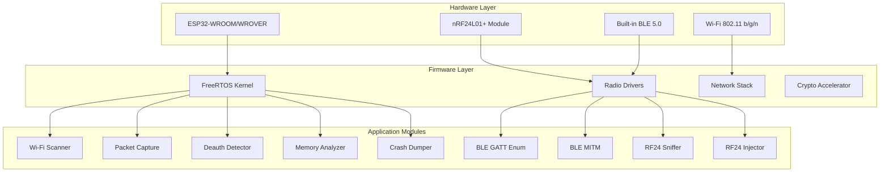

<div align="center">

# ESP32-HARNESS

**Advanced ESP32 Pentesting, Audit & Telemetry Firmware**

[](https://github.com/ykrishhh/ESP32-HARNESS)
[](https://www.espressif.com/en/products/socs/esp32)
[](https://docs.espressif.com/projects/esp-idf/)
[]()
[](LICENSE)
[](https://github.com/ykrishhh/ESP32-HARNESS/stargazers)
[](https://github.com/ykrishhh/ESP32-HARNESS/network)
[](https://github.com/ykrishhh/ESP32-HARNESS/issues)

</div>

---

## 🎯 Overview

**ESP32-HARNESS** transforms the ESP32 into a portable, self-contained security research platform. Built for authorized penetration testing, security auditing, and RF telemetry — it consolidates multiple hardware tools into a single firmware running on a $5 microcontroller.

> **⚠️ Legal Notice**: This tool is designed exclusively for authorized security testing, educational purposes, and legitimate RF research. Users are responsible for compliance with local laws and regulations.

---

## 🏗️ Architecture



---

## 🚀 Capabilities

### 📡 2.4 GHz Wi-Fi Research
| Feature | Status | Description |
|---------|--------|-------------|
| **Channel Hopping Scanner** | ✅ | Passive/active scanning across all 13 channels |
| **Raw 802.11 Capture** | ✅ | PCAP export via USB/Serial |
| **Deauth Detection** | ✅ | Real-time deauthentication attack monitoring |
| **Probe Request Tracking** | ✅ | Device presence detection & MAC randomization analysis |
| **Beacon Analysis** | 🚧 | SSID cloaking detection, WPS fingerprinting |

### 🔵 Bluetooth Low Energy (BLE)
| Feature | Status | Description |
|---------|--------|-------------|
| **GATT Enumeration** | ✅ | Service, characteristic, descriptor discovery |
| **Security Assessment** | ✅ | Pairing analysis, MITM detection, key extraction |
| **Beacon Tracking** | ✅ | iBeacon, Eddystone, custom formats |
| **GATT Fuzzer** | 🚧 | Automated characteristic fuzzing |

### 📻 RF24 / nRF24L01+ Research
| Feature | Status | Description |
|---------|--------|-------------|
| **Packet Injection** | ✅ | 2.4 GHz ISM band packet crafting |
| **Protocol Sniffing** | ✅ | Custom protocol reverse engineering |
| **Range Testing** | ✅ | Signal strength mapping (RSSI/LQI) |
| **Auto-ACK Analysis** | 🚧 | Enhanced ShockBurst protocol analysis |

### 🔍 On-Device Forensics
| Feature | Status | Description |
|---------|--------|-------------|
| **Memory Analysis** | ✅ | Heap, stack, flash inspection |
| **Runtime Monitoring** | ✅ | Task, interrupt, timing analysis |
| **Crash Dump Capture** | ✅ | Automated fault collection & export |
| **Firmware Integrity** | 🚧 | SHA-256 verification, rollback protection |

---

## 🛠️ Hardware Requirements

| Component | Specification | Notes |
|-----------|--------------|-------|
| **MCU** | ESP32-WROOM-32 / WROVER | 4MB flash minimum |
| **RF Module** | nRF24L01+ (optional) | For RF24 research |
| **Antenna** | 2.4 GHz PCB / External | U.FL connector recommended |
| **Power** | 5V USB or 3.7V LiPo | LiPo with charging circuit |
| **Debug** | UART (CP2102/CH340) | For serial monitor |

---

## ⚡ Quick Start

### Prerequisites
```bash
# Install ESP-IDF v5.1+
git clone --recursive https://github.com/espressif/esp-idf.git
cd esp-idf && ./install.sh esp32 && . ./export.sh
```

### Build & Flash
```bash
# Clone with submodules
git clone --recursive https://github.com/ykrishhh/ESP32-HARNESS.git
cd ESP32-HARNESS

# Configure target (optional)
idf.py set-target esp32

# Build firmware
idf.py build

# Flash to device (adjust port)
idf.py -p /dev/ttyUSB0 flash monitor

# Or use the helper script
./scripts/flash.sh /dev/ttyUSB0
```

### Configuration
```bash
# Interactive menuconfig
idf.py menuconfig

# Key settings:
# → ESP32-HARNESS Config
#   → Wi-Fi Channel List (default: 1-13)
#   → BLE Scan Duration (default: 30s)
#   → RF24 Channel (default: 76)
#   → Serial Baud Rate (default: 115200)
```

---

## 📁 Project Structure

```
ESP32-HARNESS/
├── .github/
│   └── workflows/          # CI/CD pipelines
├── components/
│   ├── wifi_scanner/       # Wi-Fi scanning module
│   ├── packet_capture/     # 802.11 PCAP capture
│   ├── deauth_detector/    # Deauth attack detection
│   ├── ble_enum/           # BLE GATT enumeration
│   ├── ble_mitm/           # BLE MITM framework
│   ├── nrf24/              # RF24 driver & tools
│   ├── mem_analyzer/       # Heap/stack/flash analysis
│   ├── crash_dumper/       # Automated crash collection
│   └── common/             # Shared utilities
├── main/
│   ├── main.c              # Entry point & task creation
│   ├── cli.c               # Serial command interface
│   └── config.c            # Runtime configuration
├── tools/
│   ├── pcap_export.py      # PCAP to Wireshark converter
│   ├── ble_decode.py       # BLE packet decoder
│   └── nrf_analyze.py      # RF24 protocol analyzer
├── docs/
│   ├── architecture.md     # Detailed architecture
│   ├── api_reference.md    # Module APIs
│   └── hardware_guide.md   # Wiring & setup
├── test/
│   ├── unit/               # Unit tests (Unity)
│   └── integration/        # Hardware-in-loop tests
├── assets/
│   ├── logos/              # Project logos
│   └── screenshots/        # Terminal/demo screenshots
├── CMakeLists.txt
├── sdkconfig.defaults
├── LICENSE
└── README.md
```

---

## 🖥️ Serial CLI Commands

| Command | Description | Example |
|---------|-------------|---------|
| `wifi scan` | Start channel-hopping scan | `wifi scan --channels 1,6,11` |
| `wifi capture` | Capture 802.11 frames | `wifi capture --duration 60` |
| `ble enum` | Enumerate BLE devices | `ble enum --active` |
| `ble mitm` | Start MITM proxy | `ble mitm --target AA:BB:CC:DD:EE:FF` |
| `nrf sniff` | Sniff RF24 traffic | `nrf sniff --channel 76` |
| `nrf inject` | Inject RF24 packet | `nrf inject --payload 0xDEADBEEF` |
| `mem info` | Show memory stats | `mem info --detail` |
| `sys reboot` | Reboot device | `sys reboot` |

---

## 📊 Output Formats

| Module | Format | Tool |
|--------|--------|------|
| Wi-Fi Capture | PCAP | Wireshark, tcpdump |
| BLE Traffic | JSON/PCAP | Custom decoder |
| RF24 Packets | JSON/CSV | Protocol analyzer |
| Memory Dumps | Binary/ELF | objdump, GDB |
| Crash Reports | JSON | Auto-analysis script |

---

## 🗺️ Roadmap

- [ ] **v1.1** Web dashboard for live telemetry (ESP32 web server)
- [ ] **v1.2** OTA update mechanism with signature verification
- [ ] **v1.3** Bluetooth Classic / BR/EDR support
- [ ] **v1.4** Zigbee / Thread support via CC2531
- [ ] **v1.5** GPS module integration for wardriving
- [ ] **v2.0** Multi-device mesh coordination

---

## 🤝 Contributing

1. Fork the repository
2. Create a feature branch: `git checkout -b feature/amazing-feature`
3. Run tests: `idf.py test` (Unity framework)
4. Commit changes: `git commit -m "feat: add amazing feature"`
5. Push to branch: `git push origin feature/amazing-feature`
6. Open a Pull Request

See [CONTRIBUTING.md](CONTRIBUTING.md) for detailed guidelines.

---

## 📄 License

MIT License — see [LICENSE](LICENSE) for details.

---

<div align="center">

Made with ❤️ by [Krish](https://github.com/ykrishhh) | [Portfolio](https://harrydev.one) | [Twitter](https://x.com/ykrishhh)

</div>